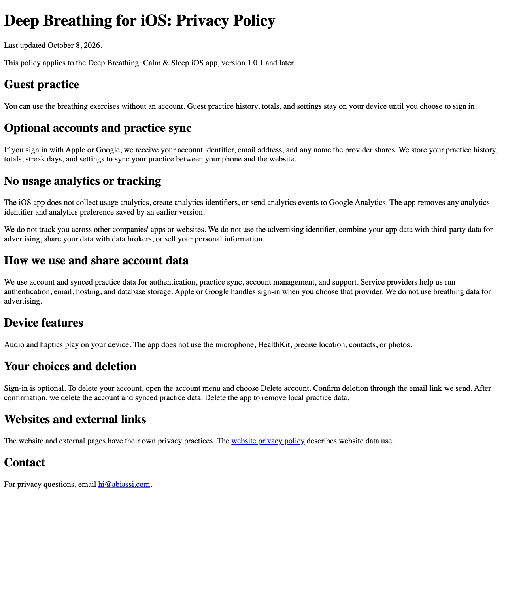

# iOS 1.0.1 privacy correction

Apple rejected build 21 on September 10, 2026 under Guideline 5.1.2(i).
Submission ID: `25d9e328-3741-464a-b019-843bcbc7a83a`.

## Target

- App: Deep Breathing: Calm & Sleep
- App Store Connect app: `6786431781`
- Bundle: `com.deepbreathing.app`
- Apple team: `M29XZH5LMJ`, Reentry Systems Unipessoal Lda
- Expo owner: `abiabiassi`
- Expo project: `c5bbb03a-2e8d-44fd-90a6-fe6ab08197a4`
- Source checkout: `/Users/abi/work/deepbreathing-ios-no-tracking`
- Branch: `fix/ios-remove-tracking`
- Base: `4dd1c69b29f20dc510e17b362f4bcec101ac7549`

## Correction

Metro resolves `ga4-mp.ios.ts` for iOS. That module has no analytics endpoint,
identifier creation, or network transport. It deletes the previous analytics
identifier and saved consent. The host does not display the custom analytics
prompt or the control that reopens it. Web and Android analytics stay unchanged.

Guest practice and settings remain local. Optional sign-in and practice sync
still collect account data for app functionality. The app does not use IDFA,
advertising attribution, or tracking across other companies' apps and websites.

## Current iOS App Privacy answers

Data collection remains **Yes** because of optional accounts and practice sync.
Tracking remains **No**. Remove the per-install analytics Device ID declaration
and remove Analytics from Product Interaction's purposes.

| Data type | Collection | Linked to user | Tracking | Purpose |
|---|---|---|---|---|
| User ID | Optional accounts | Yes | No | App Functionality |
| Email Address | Optional accounts | Yes | No | App Functionality |
| Name | Optional account provider supplies it | Yes | No | App Functionality |
| Product Interaction | Signed-in practice sync | Yes | No | App Functionality |

Recheck the saved App Store Connect label before submission. The new iOS policy
is `public/ios-privacy.html`, linked from the iOS account sheet. Deploy it through
the GitHub main workflow and verify `https://deepbreathingexercises.com/ios-privacy.html`
before building and resubmitting. Set the iOS App Store Connect Privacy Policy
URL to that address. The existing `/privacy` page stays available for the website.

The owner authorized publication of the prepared policy through GitHub main on
October 8, 2026. Preserve the Git integration production provenance guard.

## Review Notes draft

Use this text only after the exact candidate has passed verification:

> This update removes usage analytics and the custom analytics permission prompt
> from the iOS app. The iOS app no longer creates or sends analytics identifiers
> or usage analytics events, including for users who previously opted in.
> Existing local analytics identifiers and preferences are deleted on launch.
> The app does not track users across other companies' apps or websites and does
> not use the advertising identifier. No tracking permission request is present.
> Optional Apple and Google sign-in remain available solely for account access
> and practice sync. Guest breathing, local stats, audio, and haptics work without
> sign-in. The UI is bundled locally and rendered in an Expo DOM web view.

## Release record

- Source commit: `b5be1d1cc7abf656a0190c2b8c4ef3eeb301a4eb`
- Automated checks: 124 mobile tests and 463 root tests passed; 7 root tests
  skipped. Mobile typecheck/lint, Expo Doctor 21/21, release hygiene, critical
  dependency audit, Next.js production build, and post-build checks passed.
- iOS export: the source map includes only `ga4-mp.ios.ts`; it has no analytics
  endpoint, network transport, or analytics ID creation.
- Simulator Release build: succeeded with Xcode 27.0 and deployment target 16.4.
  Bundle version 1.0.1, local build number 1. This is not the signed store binary.
- Native launch and settings screenshots: blocked. SDK 56's generated native
  template lacks UIKit scene lifecycle support required by the iOS 27 SDK.
  The installed simulator app stops before JavaScript runs. Verify with the
  supported SDK 56 build toolchain instead; do not treat a successful compile
  as a UI pass. See [Expo issue 46664](https://github.com/expo/expo/issues/46664)
  and [Apple's lifecycle requirement](https://developer.apple.com/documentation/uikit/transitioning-to-the-uikit-scene-based-life-cycle).
- Simulator artifact: `/tmp/deepbreathing-ios-native-review/Build/Products/Release-iphonesimulator/DeepBreathing.app`
- Simulator main bundle SHA-256: `33b81ccc39e9e213d6abf4b27dfcce2c6c9cfed6302fddb62407e2863d65718f`
- Policy rendered locally and inspected; publication remains pending.
- EAS simulator and production profiles use `macos-tahoe-26.4-xcode-26.4`, the
  [documented SDK 56 image](https://docs.expo.dev/build-reference/infrastructure/#macos-tahoe-264-xcode-264-sdk-56).
  After Expo login, build the simulator profile for native UI and upgrade checks
  before creating the production candidate. Simulator build `ca591359-9140-4bf7-ad5f-7cb691e6b8b0` is running from
  `ffb20e4f7b306b273bc2c8b8a465bd428f8d16e4`, version 1.0.1 (21).
  The simulator build does not increment the production version.
- Production EAS build and build number: pending
- App Store processing: pending
- App Privacy readback: pending
- Review Notes saved: pending
- Resubmission status: not submitted
- Release timing: preserve the existing manual release setting

## Remaining access

Expo login is verified as `abiabiassi`. Safari is authenticated in App Store
Connect as Amorim Ferreira, Reentry Systems Unipessoal Lda. Live readback confirms
app 6786431781, rejected version 1.0.1 with build 21, and manual release.
The published label still lists Device ID for Analytics and Product Interaction
for Analytics and App Functionality. It does not yet include User ID.
No App Store upload, metadata mutation, or resubmission has occurred.

## Listing corrections prepared for submission

Replace the English PRIVACY paragraph with:

> The iOS app does not collect usage analytics or track you across other companies’
> apps and websites. The app works without an account. Optional Apple or Google
> sign-in syncs practice sessions and settings. See our iOS Privacy Policy at
> deepbreathingexercises.com/ios-privacy.html.

Add to What’s New and remove the old statement about analytics choices:

> Usage analytics and the analytics permission prompt have been removed from the
> iOS app. Optional accounts still let you sync your breathing practice.

Review each saved localization for equivalent stale analytics wording before
submission. Do not change unrelated listing copy.

Policy review evidence, rendered locally and inspected:

